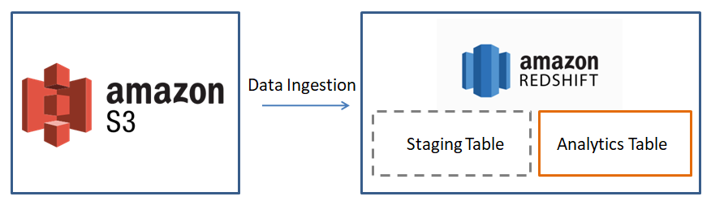

## Introduction
- A music streaming startup, Sparkify, has grown their user base and song database and want to move their processes and data onto the cloud. Their data resides in S3, in a directory of JSON logs of user activity on the app, as well as a directory with JSON metadata of the songs information in their app.

- We will build a ETL data pipeline to move these data from S3 to data warehouse redshift. 

## Architecture


## Requirements
- Create AWS Redshift cluster
- Create a Role with Permission to access the required data which are stored in AWS S3 
- Access permission to AWS Redshift 
- Python 3
- Install pyscog2: `pip install psycopg2`
- Fill in the appropriate configurations in the `dwh.cfg` file, these configs allow us access to AWS resources, should keep it private.

## Dataset
### Song dataset
- The dataset is a subset of real data from the [Million Song Dataset](http://millionsongdataset.com/). Each file is in JSON format and contains metadata about a song and the artist of that song.

- Example: `{"num_songs": 1, "artist_id": "ARJIE2Y1187B994AB7", "artist_latitude": null, "artist_longitude": null, "artist_location": "", "artist_name": "Line Renaud", "song_id": "SOUPIRU12A6D4FA1E1", "title": "Der Kleine Dompfaff", "duration": 152.92036, "year": 0}`
    
### User activity dataset  
- The second dataset consists of log files in JSON format generated by the event simulator based on the songs in the dataset above. These simulate app activity logs from an imaginary music streaming app based on configuration settings.


## Create Table Schema
Execute the script: _create_tables.py_: 
```
python create_tables.py
```
This will connect to the Redshift cluster and execute the queries to
create the following tables Redshift.
Include both staging table and dimension model table. 
- Staging
    - staging_events
    - staging_songs
- Dimensional model
    - songplays
    - users
    - songs
    - artists
    - time

## Build ETL Pipeline
Execute the script: _etl.py_: 
```
python etl.py
```
This will connect to the Redshift cluster and load the data from S3:
- Song data: `s3://udacity-dend/song_data`
- Log data: `s3://udacity-dend/log_data`

Loaded data will be stored in the staging tables firstly, `staging_events` and `staging_songs`, then it will be transformed into the analytic tables of star schema for data consumers.